********
<center>
# Spring 2018 CS543:  Assignment 0  
**@author**: Ziyu Zhou  

</center>
********

## 1 Basic Implementation


### 1.1 Libraries & Functions
#### 1.1.1 Libraries
The solution is implemented in Python. Several libraries are used in this assignment:  

* OpenCV: To perform Basic image processing; compute NCC.
* Numpy: To manipulate the image matrices; compute SSD.


#### 1.1.2 Funtcions for Image Shifting
The inbuilt function `roll()` of the Numpy library can shift the image matrix according to the given displacement along given axes, which works essentially the same as `circshift()` in MATLAB. In the implemented solution, `roll()` is used to shift the image matrix by an offset `(x, y)`, which corresponds to the displacements along the `x`-axis and `y`-axis respectively. An example is `np.roll(image, (x, y), axis=(1, 0))`.

Similarly, after obtaining the best offset through exhaustive searching, the corresponding image will be actually shifted to align with the reference image. For example, if the blue (B) channel is the reference, to align the green (G) and red (R) channels to it, simply apply `np.roll(G, offset_G, axis=[1, 0])` and `np.roll(R, offset_R, axis=[1, 0])`.


### 1.2 Matching Metrics
There are two matching metrics applied in this solution, which are SSD and NCC. The patterns of their performance are hard to determine. The results of applying SSD and NCC on the 6 input images show that SSD works better on 3 of them and NCC gives a more desirable result on the others. (See **Section 2** for detailed results and analysis)

#### 1.2.1 Sum of Squared Differences (SSD)
SSD is implemented using basic Numpy array operation, which is `((mat1 - mat2) ** 2).sum() `. The usage in the solution is

```python
ssd = lambda mat1, mat2: ((mat1 - mat2) ** 2).sum()
```

Compared to NCC, SSD runs pretty fast because it does not require normalization which is very expensive in computation.  
A potential problem of SSD is that it is very sensitive to image intensity as well as image colors. If the values of brightness are varied greatly across different channels or the image is very colorful in certain region, SSD tends to fail.  
Another possible problem lies in its sensitivity to window size. As observed from the aligning process, if the window size is relatively large, SSD seems to capture more unrelated noise and thus produces undesirable results. In this sense, sometimes the quality of the output image aligned by SSD can be even worse than that obtained by just simply stacking the three channels without any alignment.

#### 1.2.2 Normalized Cross-Correlation (NCC)
NCC is implemented using the `matchTemplate()` function in OpenCV, see below. The parameter `cv2.TM_CCORR_NORMED` indicates to use NCC as the matching method. However, the NCC method here only performs normalization without demeaning the image matrices. Thus, demeaning should be explicitly conducted before passing the matrices to this function.

```python
ncc = lambda mat1, mat2: cv2.matchTemplate(np.float32(mat1-mat1.mean()), 
                                           np.float32(mat2-mat2.mean()), 
                                           cv2.TM_CCORR_NORMED)[0, 0]
```

As mentioned above, NCC is computationally expensive compared to SSD. However, it is more robust under varied brightness levels and rich colors because of the normalization. An interesting observation is that considering this nature of NCC, SSD still outperforms it in some cases if the window size is carefully chosen.


## 2 Output Color Images & Analysis

### 2.1 Image 00125v.jpg

#### 2.1.1 Best Color Image
The following table shows the best output color image and its alignment information for image `00125v.jpg`, including metric used, reference channel and displacement vectors. This result is given by the NCC metric, taking the R channel as a reference (i.e., R channel is not shifted) and aligning B and G channels to it with displacements `[2, -10]` and `[-1, 4]` respectively.  
There is no obvious artifact in this output.

<center>

| Original Image                                                                                                               | Best Color Image                                                                                                                                                                                                                                                                         |
|------------------------------------------------------------------------------------------------------------------------------|------------------------------------------------------------------------------------------------------------------------------------------------------------------------------------------------------------------------------------------------------------------------------------------|
|  | 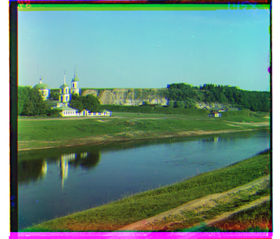<br> <br> <center>**Alignment Information**<br></center> <ul><li>Metric: NCC  <li>Reference: R channel  <li>Displacement [x, y]:   <ul><li>B channel: [2, -10]   <li>G channel: [-1, 4] |

</center>

#### 2.1.2 Other Output Images
The following table displays all the output images generated by using SSD and NCC on top of taking B, G, R channels as reference respectively. Which combination works the best depends on specific images.  
In this case, NCC works much better than SSD. SSD fails when applying G and R as reference but yields a relatively good result given reference B. This indicates that using different channels as reference will affect the quality of the output image.


|                             |                                               B Channel as Reference                                               |                                               G Channel as Reference                                               |                                               R Channel as Reference                                               |
|:---------------------------:|:------------------------------------------------------------------------------------------------------------------:|:------------------------------------------------------------------------------------------------------------------:|:------------------------------------------------------------------------------------------------------------------:|
|             **SSD**             | 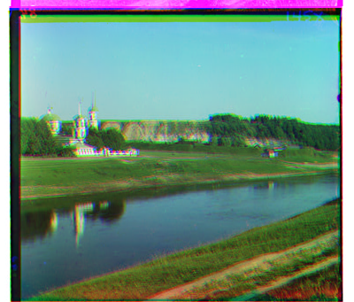 | 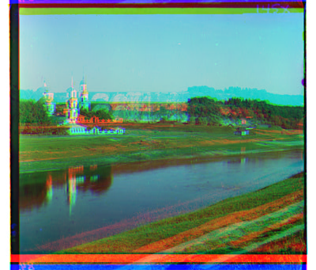 | 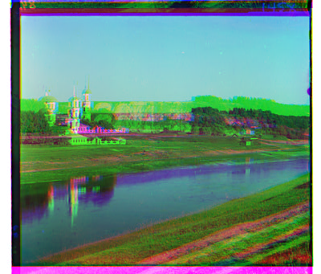 |
| Displacement [x, y] for SSD |                                     G channel: [-1, 7] <br> R channel: [-3, 9]                                     |                                    B channel: [1, -7] <br> R channel: [-1, -10]                                    |                                    B channel: [3, -9] <br> G channel: [-1, -10]                                    |
|             **NCC**             | 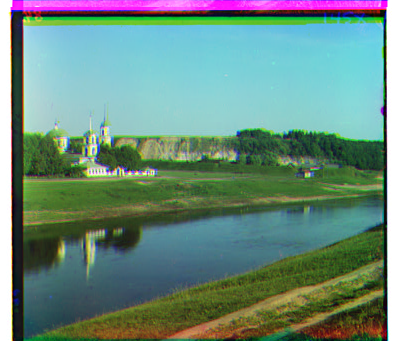 | 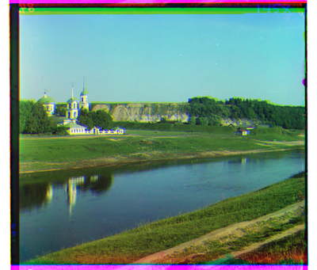 |  |
| Displacement [x, y] for NCC |                                     G channel: [-1, 7] <br> R channel: [-2, 10]                                    |                                     B channel: [1, -7] <br> R channel: [-1, 4]                                     |                                     B channel: [2, -10] <br> G channel: [-1, 4]                                    |


### 2.2 Image 00149v.jpg

#### 2.2.1 Best Color Image

The following table shows the best output color image and its alignment information for image `00149v.jpg`. This result is given by the NCC metric, taking the R channel as a reference (i.e., R channel is not shifted) and aligning B and G channels to it with displacements `[-1, 9]` and `[0, 5]` respectively.  
There is no obvious artifact in this output.


<center>

| Original Image                                                                                                               | Best Color Image                                                                                                                                                                                                                                                                         |
|------------------------------------------------------------------------------------------------------------------------------|------------------------------------------------------------------------------------------------------------------------------------------------------------------------------------------------------------------------------------------------------------------------------------------|
|  | <br> <br> <center>**Alignment Information**<br></center> <ul><li>Metric: NCC  <li>Reference: R channel  <li>Displacement [x, y]:   <ul><li>B channel: [-1, -9]   <li>G channel: [0, 5] |

</center>

#### 2.2.2 Other Output Images
The following table displays all the output images generated by using SSD and NCC on top of taking B, G, R channels as reference respectively.  
SSD dose not perform well in this case. No matter using which channel as reference, the R channel can't be properly aligned. For NCC, different references do not make a big difference in the output quality. They all work pretty well.


|                             |                                               B Channel as Reference                                               |                                               G Channel as Reference                                               |                                               R Channel as Reference                                               |
|:---------------------------:|:------------------------------------------------------------------------------------------------------------------:|:------------------------------------------------------------------------------------------------------------------:|:------------------------------------------------------------------------------------------------------------------:|
|             **SSD**             | 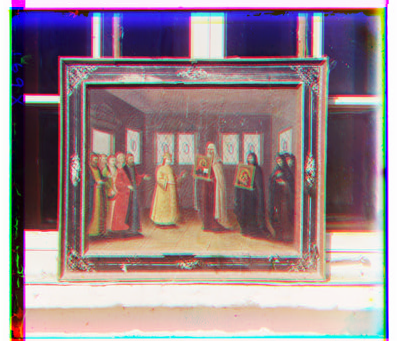 | 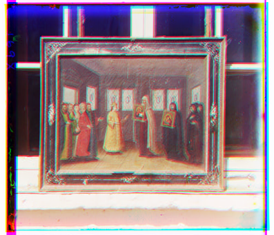 | 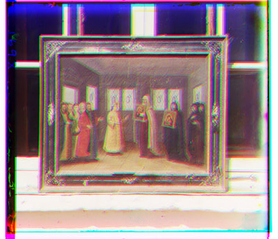 |
| Displacement [x, y] for SSD |                                     G channel: [2, 4] <br> R channel: [0, 7]                                     |                                    B channel: [-2, -4] <br> R channel: [2, 3]                                    |                                    B channel: [0, -7] <br> G channel: [2, 3]                                    |
|             **NCC**             | 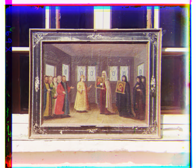 | 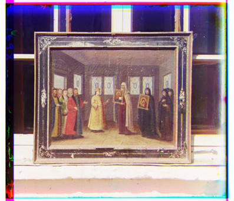 |  |
| Displacement [x, y] for NCC |                                     G channel: [1, 4] <br> R channel: [1, 9]                                    |                                     B channel: [-1, -4] <br> R channel: [0, 5]                                     |                                     B channel: [-1, -9] <br> G channel: [0, 5]                                    |


### 2.3 Image 00153v.jpg

#### 2.3.1 Best Color Image

The following table shows the best output color image and its alignment information for image `00153v.jpg`. This result is given by the NCC metric, taking the R channel as a reference (i.e., R channel is not shifted) and aligning B and G channels to it with displacements `[-3, -7]` and `[2, 7]` respectively.  
However, this image is not perfectly aligned. The color of the clothes and the face of the person in the image is not completely correct. A possible reason might be the unusual color of the clothing.


<center>

| Original Image                                                                                                               | Best Color Image                                                                                                                                                                                                                                                                         |
|------------------------------------------------------------------------------------------------------------------------------|------------------------------------------------------------------------------------------------------------------------------------------------------------------------------------------------------------------------------------------------------------------------------------------|
|  | 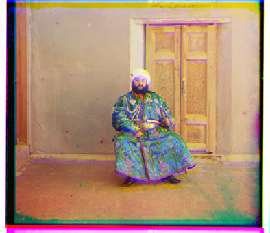<br> <br> <center>**Alignment Information**<br></center> <ul><li>Metric: NCC  <li>Reference: R channel  <li>Displacement [x, y]:   <ul><li>B channel: [-3, -7]   <li>G channel: [2, 7] |

</center>

#### 2.3.2 Other Output Images

The following table displays all the output images generated by using SSD and NCC on top of taking B, G, R channels as reference respectively. SSD fails in most cases, possibly due to the different brightness in each channel.

|                             |                                               B Channel as Reference                                               |                                               G Channel as Reference                                               |                                               R Channel as Reference                                               |
|:---------------------------:|:------------------------------------------------------------------------------------------------------------------:|:------------------------------------------------------------------------------------------------------------------:|:------------------------------------------------------------------------------------------------------------------:|
|             **SSD**             | 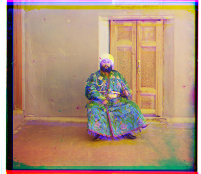 | 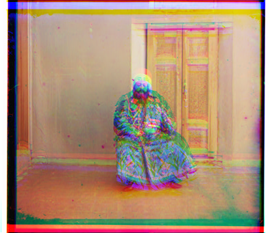 | 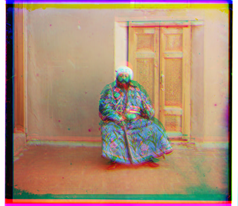 |
| Displacement [x, y] for SSD |                                     G channel: [2, -3] <br> R channel: [3, 4]                                     |                                    B channel: [-2, 3] <br> R channel: [2, -1]                                    |                                    B channel: [-3, -4] <br> G channel: [2, -1]                                    |
|             **NCC**             | 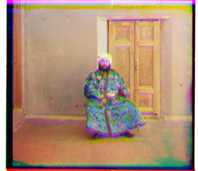 | 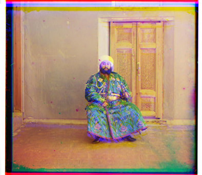 |  |
| Displacement [x, y] for NCC |                                     G channel: [2, -3] <br> R channel: [3, 7]                                    |                                     B channel: [-2, 3] <br> R channel: [2, 7]                                     |                                     B channel: [-3, -7] <br> G channel: [2, 7]                                    |


### 2.4 Image 00351v.jpg

#### 2.4.1 Best Color Image

The following table shows the best output color image and its alignment information for image `00351v.jpg`. This result is given by the SSD metric, taking the G channel as a reference (i.e., G channel is not shifted) and aligning B and R channels to it with displacements `[0, -4]` and `[1, 9]` respectively.  
There is no obvious problem in this output.

<center>

| Original Image                                                                                                               | Best Color Image                                                                                                                                                                                                                                                                         |
|------------------------------------------------------------------------------------------------------------------------------|------------------------------------------------------------------------------------------------------------------------------------------------------------------------------------------------------------------------------------------------------------------------------------------|
|  | <br> <br> <center>**Alignment Information**<br></center> <ul><li>Metric: SSD  <li>Reference: G channel  <li>Displacement [x, y]:   <ul><li>B channel: [0, -4]   <li>R channel: [1, 9] |

</center>


#### 2.4.2 Other Output Images

The following table displays all the output images generated by using SSD and NCC on top of taking B, G, R channels as reference respectively. For this image, both NCC and SSD work pretty well when using G or R channel as reference. 


|                             |                                               B Channel as Reference                                               |                                               G Channel as Reference                                               |                                               R Channel as Reference                                               |
|:---------------------------:|:------------------------------------------------------------------------------------------------------------------:|:------------------------------------------------------------------------------------------------------------------:|:------------------------------------------------------------------------------------------------------------------:|
|             **SSD**             | 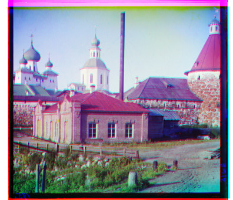 |  | 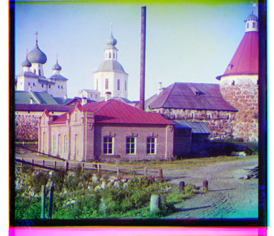 |
| Displacement [x, y] for SSD |                                     G channel: [0, 4] <br> R channel: [1, 11]                                     |                                    B channel: [0, -4] <br> R channel: [1, 9]                                    |                                    B channel: [-1, -11] <br> G channel: [1, 9]                                    |
|             **NCC**             | 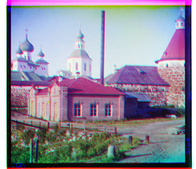 | 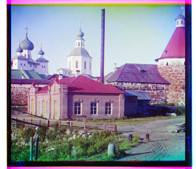 | 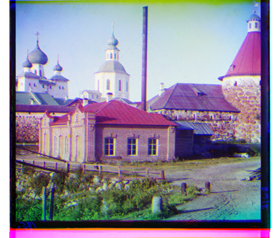 |
| Displacement [x, y] for NCC |                                     G channel: [0, 4] <br> R channel: [-1, 11]                                    |                                     B channel: [0, -4] <br> R channel: [0, 9]                                     |                                     B channel: [1, -11] <br> G channel: [0, 9]                                    |


### 2.5 Image 00398v.jpg

#### 2.5.1 Best Color Image

The following table shows the best output color image and its alignment information for image `00398v.jpg`. This result is given by the SSD metric, taking the B channel as a reference (i.e., B channel is not shifted) and aligning G and R channels to it with displacements `[-1, 9]` and `[-2, 15]` respectively.  
This image is not perfectly aligned. The edeges of the trees and the roof are surrounded by a small region of the uncorrect yellow color, possibly due to the wrong alignment of the G and B channels.

<center>

| Original Image                                                                                                               | Best Color Image                                                                                                                                                                                                                                                                         |
|------------------------------------------------------------------------------------------------------------------------------|------------------------------------------------------------------------------------------------------------------------------------------------------------------------------------------------------------------------------------------------------------------------------------------|
|  | 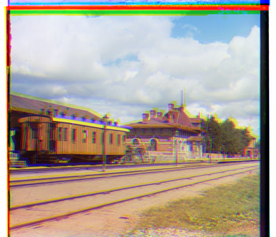<br> <br> <center>**Alignment Information**<br></center> <ul><li>Metric: SSD  <li>Reference: B channel  <li>Displacement [x, y]:   <ul><li>G channel: [-1, 9]   <li>R channel: [-2, 15] |

</center>


#### 2.5.2 Other Output Images

The following table displays all the output images generated by using SSD and NCC on top of taking B, G, R channels as reference respectively. None of the methods work very well on this image.


|                             |                                               B Channel as Reference                                               |                                               G Channel as Reference                                               |                                               R Channel as Reference                                               |
|:---------------------------:|:------------------------------------------------------------------------------------------------------------------:|:------------------------------------------------------------------------------------------------------------------:|:------------------------------------------------------------------------------------------------------------------:|
|             **SSD**             |  |  |  |
| Displacement [x, y] for SSD |                                     G channel: [-1, 9] <br> R channel: [-2, 15]                                     |                                    B channel: [1, -9] <br> R channel: [-1, 10]                                    |                                    B channel: [2, -15] <br> G channel: [-1, 10]                                    |
|             **NCC**             | 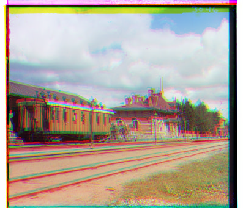 |  | 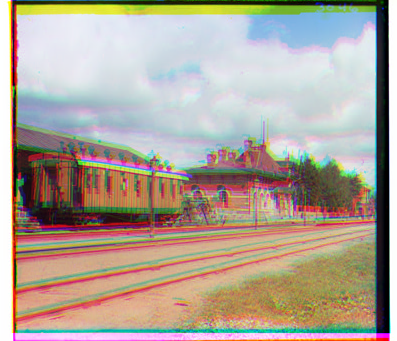 |
| Displacement [x, y] for NCC |                                     G channel: [-1, 7] <br> R channel: [-2, 8]                                    |                                     B channel: [1, -7] <br> R channel: [-1, 0]                                     |                                     B channel: [2, -8] <br> G channel: [-1, 0]                                    |


### 2.6 Image 01112v.jpg

#### 2.6.1 Best Color Image

The following table shows the best output color image and its alignment information for image `01112v.jpg`. This result is given by the SSD metric, taking the G channel as a reference (i.e., G channel is not shifted) and aligning B and R channels to it with displacements `[0, 0]` and `[1, 5]` respectively.  
An interesting observation is that the displacement of B channel is `[0, 0]`, indicating that B and G channels are originally perfectly aligned.

<center>

| Original Image                                                                                                               | Best Color Image                                                                                                                                                                                                                                                                         |
|------------------------------------------------------------------------------------------------------------------------------|------------------------------------------------------------------------------------------------------------------------------------------------------------------------------------------------------------------------------------------------------------------------------------------|
|  | <br> <br> <center>**Alignment Information**<br></center> <ul><li>Metric: SSD  <li>Reference: G channel  <li>Displacement [x, y]:   <ul><li>B channel: [0, 0]   <li>R channel: [1, 5] |

</center>


#### 2.6.2 Other Output Images

The following table displays all the output images generated by using SSD and NCC on top of taking B, G, R channels as reference respectively. For this image, SSD outperforms NCC in every case.


|                             |                                               B Channel as Reference                                               |                                               G Channel as Reference                                               |                                               R Channel as Reference                                               |
|:---------------------------:|:------------------------------------------------------------------------------------------------------------------:|:------------------------------------------------------------------------------------------------------------------:|:------------------------------------------------------------------------------------------------------------------:|
|             **SSD**             |  |  | 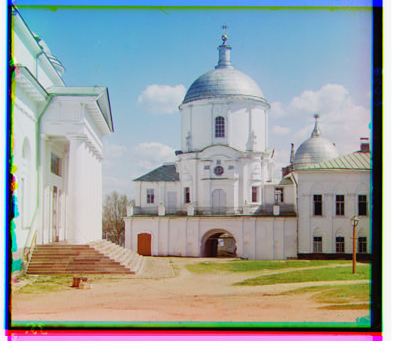 |
| Displacement [x, y] for SSD |                                     G channel: [0, 0] <br> R channel: [1, 5]                                     |                                    B channel: [0, 0] <br> R channel: [1, 5]                                    |                                    B channel: [-1, -5] <br> G channel: [1, 5]                                    |
|             **NCC**             | 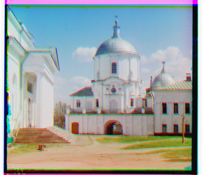 | 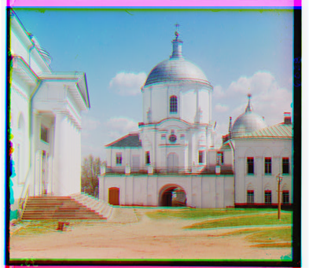 | 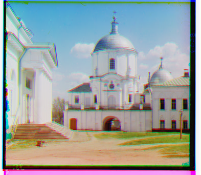 |
| Displacement [x, y] for NCC |                                     G channel: [1, 0] <br> R channel: [3, 8]                                    |                                     B channel: [-1, 0] <br> R channel: [1, 8]                                     |                                     B channel: [-3, -8] <br> G channel: [1, 8]                                    |
