********

# Spring 2018 CS543:  Assignment 2  
**@author**: Ziyu Zhou  

********

## 1 Implementation Choices

The solution is implemented in Python.

### 1.1 Load and Preprocess Image
This part is implemented in fucntion `load_and_preprocess()`.

### 1.2 Build Laplacian Scale Space
Two methods are implemented to build the Laplacian scale space. This part is implemented in function `get_scale_space()`.

#### 1.2.1 "Inefficient" Method: Increasing Filter Size
This part is implemented in function `increase_filter_size()` in `get_scale_space()`. The basic steps are:

```
For every level in scale space
	Compute filter size based on current sigma and ensure the size to be odd
	Obtain normalized Laplacian filter
	Convolve image with filter and assign the squared response to current scale 
	Update sigma
```

Note that the size of the filter is odd so that it can be centered on top of a pixel. Since the Laplacian filter is symmetric, using a square filter should be suitable.

In **line 3** above, to obtain a proper Laplacian filter, the filter should first be initialized as a matrix whose center element is 1 before passed to the `scipy.ndimage.filters.gaussian_laplace` function, otherwise the filter will be filled with zeros. The method is shown below:

```python
# Initialize filter matrix.
center = int((filter_size + 1)/2 - 1)  # index of center entry
gauss_filter = np.zeros((filter_size, filter_size))
gauss_filter[center][center] = 1

# Obtain filter with normalization.
LoG = sigma[i]*sigma[i]*gaussian_laplace(gauss_filter, sigma[i])
```

#### 1.2.2 "Efficient" Method: downsampling
This part is implemented in function `downsample()` in `get_scale_space()`. The basic steps are:

```
Compute and ensure odd filter size
Obtain Laplacian filter (no normalization needed)
For every level in scale space
	Downscale the image 
	Convolve scaled image with filter and get squared response
	Upscale the image
	Update sigma (used to compute radius of the blobs)
```

Note that there is no normalization needed for the filter since it is unchanged.


### 1.3 Nonmaximum Suppression
This part is implemented in function `non_max_sup_3D()`, which is built based on the result of `non_max_sup_2D()`, a helper function to perform nonmaximum suppression for every slice.

#### 1.3.1 2D Nonmaximum Suppression
Two methods, i.e., `rank()` with `rank_filter` and `generic()` with `generic_filter` are used to perform 2D nonmax suppression in `non_max_sup_2D()`.

Based on several experiments, `rank_filter` runs much faster than `generic_filter`. For example, when applied on the `butterfly` image, `rank_filters` needs only 0.084490s, while `generic_filter` takes 10.530548s. Thus, further implements just use the former.

#### 1.3.2 3D Nonmaximum Suppression
The basic steps for applying nonmaximum suppression in the scale space are:

```
Obtain local 2D nonmax suppression using rank_filter
Initialize global_max matrix to be all zeros
For every pixel
	Find its maximum value and the corresponding slice in the scale space
	Assign this value to the pixel at that slice
Eliminate duplicate values
```

After the above steps, only the maximum values accross all slices are preserved, and all other pixels are set 0.

### 1.4 Detect Blobs
The `detect_blob()` function is used to obtain the center points and radius of blobs after nonmaximum suppression. 

#### 1.4.1 Basic Idea
Only the pixels that are greater than the threshold and are inside of the mask filter can survive, which will then be detected as the centers of the blobs, see below for the codes:

```python
global_max[:,:,i] = np.where((global_max[:,:,i] > threshold) & 
                             (mask[:,:,i] == 1), 1, 0)
```

#### 1.4.2 Mask Filter
The mask filter is used to eliminate noises near the boundaries. The image pixels inside the region where the elements are ones in the mask filter will preserve its original values, while the others will be set to zero.

```python
def get_mask(h, w, levels, sigma):
    mask = np.zeros((h, w, levels))
    for i in range(levels):
        b = int(math.ceil(sigma[i] * math.sqrt(2)))  # Boundary.
        mask[b+1:h-b, b+1:w-b] = 1
    return mask
```

Here are two examples with and without this filter. We can notice that some noise blobs on the boundaries are gone.

|        | Without mask filter                                                                                                              | Without mask filter                                                                                                           |
|--------|----------------------------------------------------------------------------------------------------------------------------------|-------------------------------------------------------------------------------------------------------------------------------|
| Result | 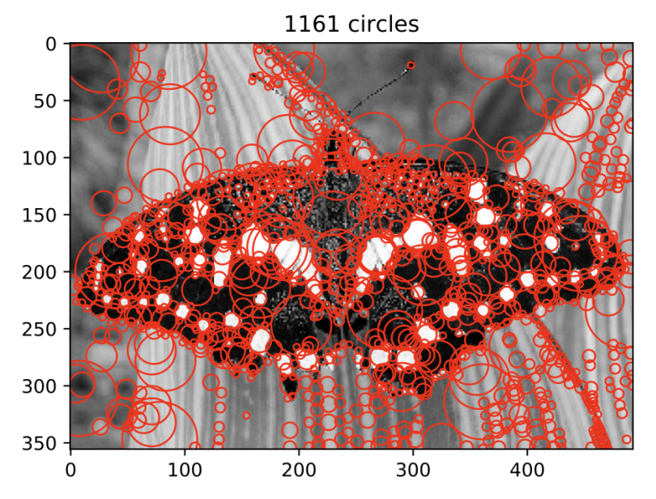 | 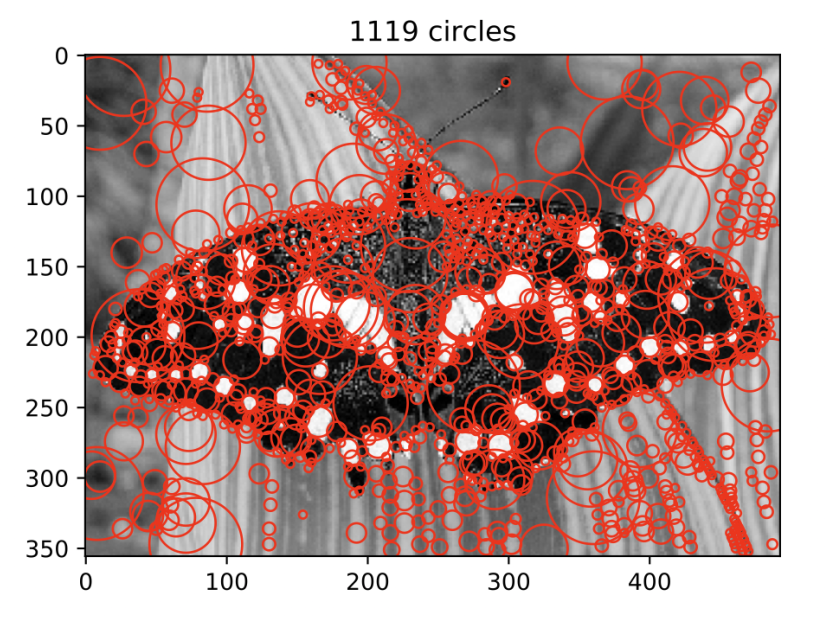 |


## 2 Outputs of the Blob Detector

### 2.1 Outputs of the Given Images

#### 2.1.1 `butterfly`

The "inefficient" method seems to produce a slightly better result than the "efficient" method although it runs relatively slow. A possible reason is that resizing images in the downsampling method cause some lost on the details of the image.

|                                      | `butterfly`                                                                                                                                           | Running Time |
|--------------------------------------|-------------------------------------------------------------------------------------------------------------------------------------------------------|--------------|
| Original</br> image                  | <center>  </center>                           |              |
| Increase </br>filter size </br> (inefficient) | 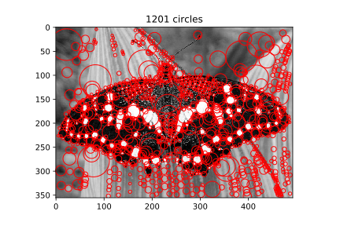 | 30.933619s   |
|      Downsampling (efficient)      | 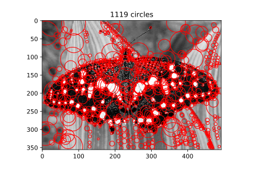           | 0.439230s    |


#### 2.1.2 `einstein`

Some blobs produced by the downsampling method are quite close to each other on Einstein's hand and they seem to merge together.

|                                      | `einstein`                                                                                                                                           | Running Time |
|--------------------------------------|-------------------------------------------------------------------------------------------------------------------------------------------------------|--------------|
| Original</br> image                  | <center>  </center>                           |              |
| Increase </br>filter size </br> (inefficient) | 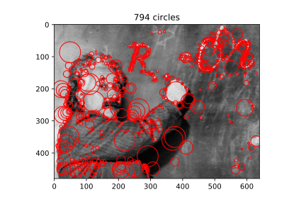 | 37.035035s   |
|      Downsampling  (efficient)      |            | 0.794025s    |


#### 2.1.3 `fishes` 

The results are quite similar. They all have strong response on the edges.

|                                      | `fishes`                                                                                                                                           | Running Time |
|--------------------------------------|-------------------------------------------------------------------------------------------------------------------------------------------------------|--------------|
| Original</br> image                  | <center>  </center>                           |              |
| Increase </br>filter size </br> (inefficient) | 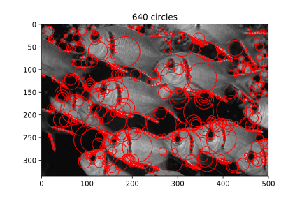 | 28.032413s   |
|      Downsampling  (efficient)      | 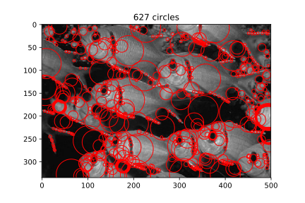           | 0.443065s    |


#### 2.1.4 `sunflowers`

Some blobs produced by the downsampling method are quite close to each other on the sunflower at the bottom and they seem to merge together.


|                                      | `sunflowers`                                                                                                                                           | Running Time |
|--------------------------------------|-------------------------------------------------------------------------------------------------------------------------------------------------------|--------------|
| Original</br> image                  | <center>  </center>                           |              |
| Increase </br>filter size </br> (inefficient) |  | 25.306132s   |
|      Downsampling  (efficient)      | 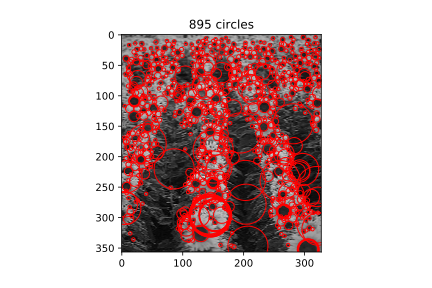           | 0.323074s 


### 2.2 Outputs of the Self Choices

#### 2.2.1 `martin`

|                                      | `martin`                                                                                                                                           | Running Time |
|--------------------------------------|-------------------------------------------------------------------------------------------------------------------------------------------------------|--------------|
| Original</br> image                  | <center>  </center>                           |              |
| Increase </br>filter size </br> (inefficient) | 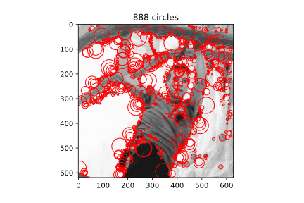 | 45.056452s   |
|      Downsampling  (efficient)      | 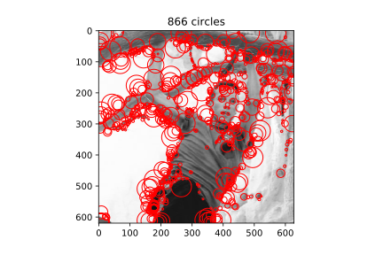           | 0.898988s    |

#### 2.2.2 `cat` 

|                                      | `cat`                                                                                                                                           | Running Time |
|--------------------------------------|-------------------------------------------------------------------------------------------------------------------------------------------------------|--------------|
| Original</br> image                  | <center> 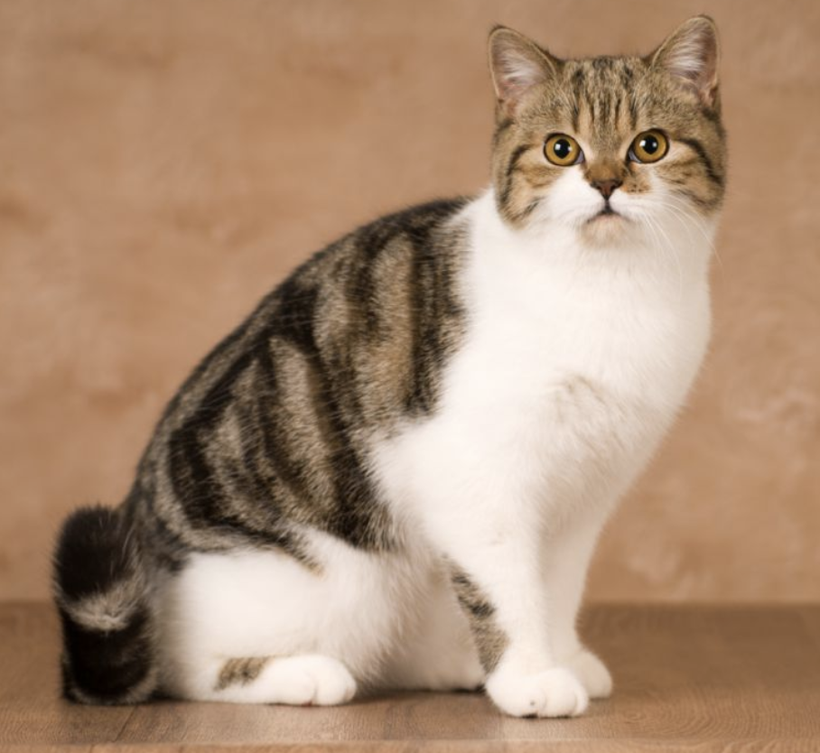 </center>                           |              |
| Increase </br>filter size </br> (inefficient) | 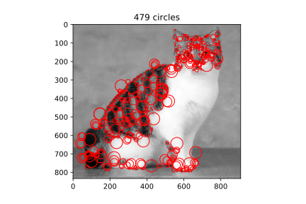 | 81.843573s   |
|      Downsampling  (efficient)      |            | 1.811655s    |


#### 2.2.3 `roman`

|                                      | `roman`                                                                                                                                           | Running Time |
|--------------------------------------|-------------------------------------------------------------------------------------------------------------------------------------------------------|--------------|
| Original</br> image                  | <center>  </center>                           |              |
| Increase </br>filter size </br> (inefficient) |  | 109.37071s   |
|      Downsampling  (efficient)      |            | 2.016057s    |


#### 2.2.4 `car`  

|                                      | `car`                                                                                                                                           | Running Time |
|--------------------------------------|-------------------------------------------------------------------------------------------------------------------------------------------------------|--------------|
| Original</br> image                  | <center>  </center>                           |              |
| Increase </br>filter size </br> (inefficient) | 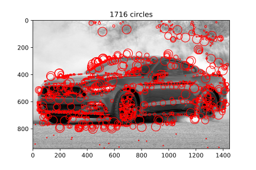 | 140.50351s   |
|      Downsampling  (efficient)      | 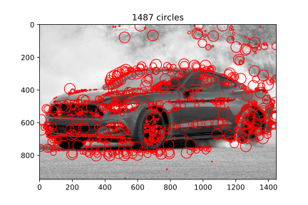           | 3.099503s    |


## 3 Parameter Values

The final parameters values are:

* `levels` = 12 (levels in the scale pyramid)
* `k` = 1.25  (the scaling factor)
* `init_sigma` = 2  (the initial scale)
* `thresholds`  see the table below

| Thresholds for different images                                                | Increase filter size   (inefficient) | Downsampling,(efficient) |
|------------------------------------------------------------|--------------------------------------|--------------------------|
| `butterfly`, `einstein`,  `fishes`, `martin`, `cat`, `car` | 0.0000001                            | 0.000000008              |
| `sunflowers`                                               | 0.00000018                           | 0.000000015              |
| `roman`                                                    | 0.00000018                           | 0.00000002               |


### 3.1 `levels`, `k` and `init_sigma`

I tested `levels` from 10 to 15 (i.e., 11, 12, 13, 14, 15), and `k` for 1.2, 1.3, 1.4 and 1.5. I noticed that `k` should not be too big otherwise the scales will be hard to match. `k`=1.2 and 1.3 worked well, so I took further tests on values between $[1.2, 1.3]$, and finally found that 1.25 worked quite reasonably.

The values of `levels` are tested together with `k`. In my case, too many levels would generate some unreasonable blobs so I chose a smaller value, which is `levels` = 12.

For `init_sigma`, I just tested on 2 and 3. Since `init_sigma`=2 gave very good results so I didn't do much further tests. 

### 3.2 `thresholds`

Thresholds are hard to determine. All images require very small thresholds because the pixel values are in the range of $10^{-5}$ to $10^{-10}$ after convolved with the Laplacian filter. The pixel values generated by the downsampling method are even smaller, some of which go down to $10^{-11}$. Thus, the thresholds for the "inefficient" and "efficient" method are considered separately.

I tested on many thresholds in the above ranges and found the values shown on the above table to be reasonable. There might be better values, but those may need additional functions to search. 

Note that for `roman` image, the threholds produce more than 3000 blobs (see **_Section 2.2.3_**). Although this might seem to much, but since the origianl image contains rich information, I believe it is suitable to presever all those blobs to reveal the details.
